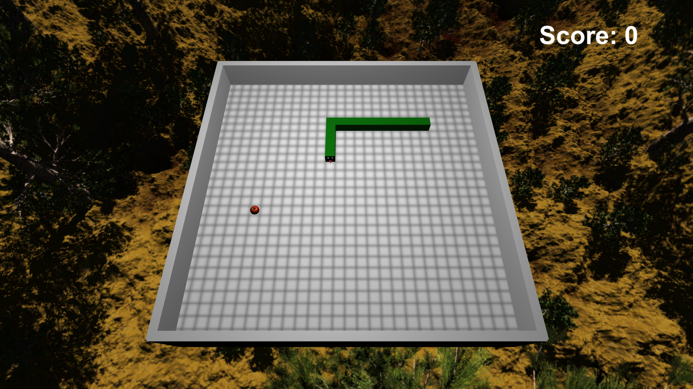
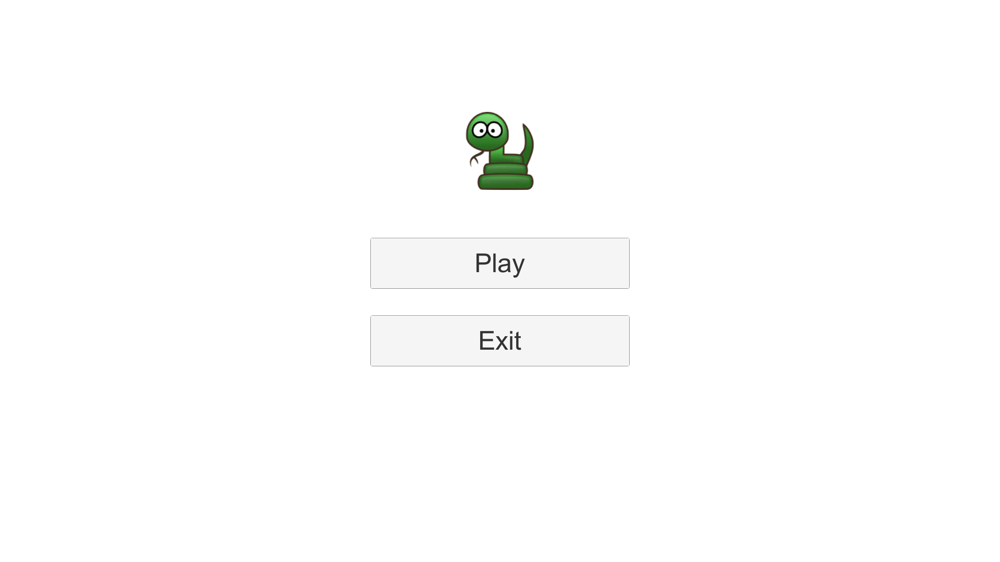

# 3D-snake
The classic snake game implemented in my own way

## Getting Started

Follow the below instructions to get started with 3D-Snake source code:

1. [Make sure you have all Requirements](#requirements)
2. Download Source Code
3. Open Project in Unity and Enjoy!

## Screenshots

## Requirements

Make sure you have the below requirements before starting:

- [Unity Game Engine](https://unity3d.com)
- Basic knowledge in Unity and C#

## Implementation Notes

The snake doesn't really move. It is based on a spawning pool that creates snake-nodes on the grid depending on the direction that you choose. Other than that, the classic design of the game exists as it is. Enjoy :)

## Target Platform

It's made for windows and 1920x1080 display but can be customized if desired.

## Updates
* New loading page

* Bug fixed
1) Self collision logic implemented
2) Random initial position and direction removed of the snake (now user fixed position)
3) Food on body spawn bug removed
